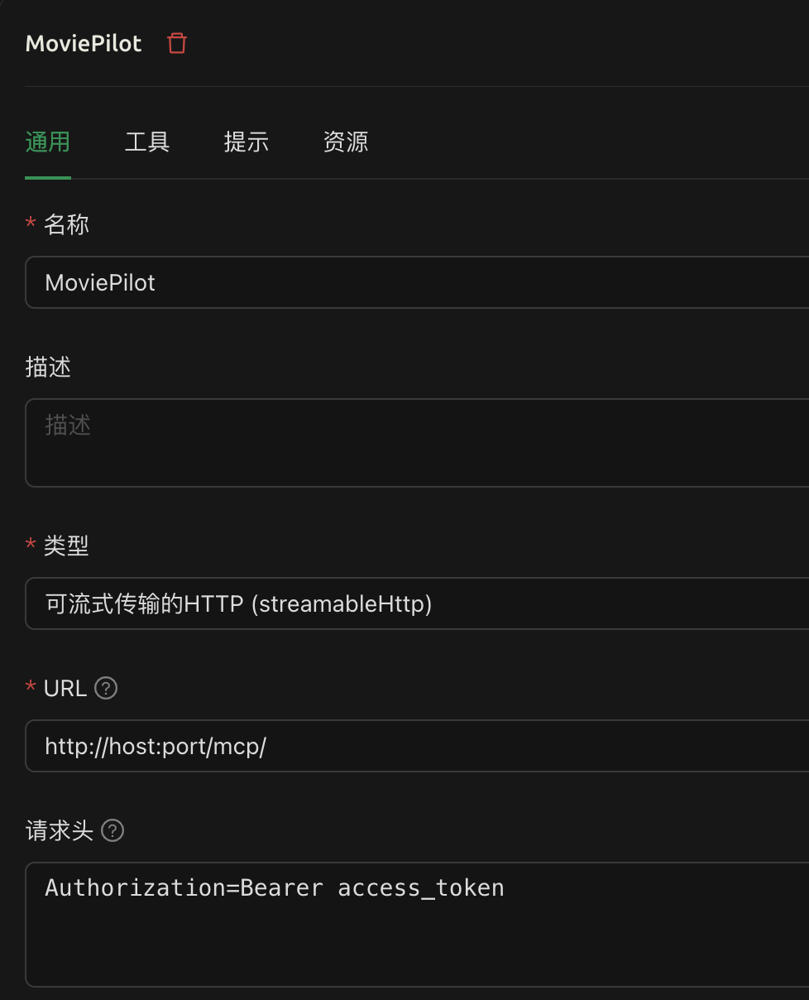
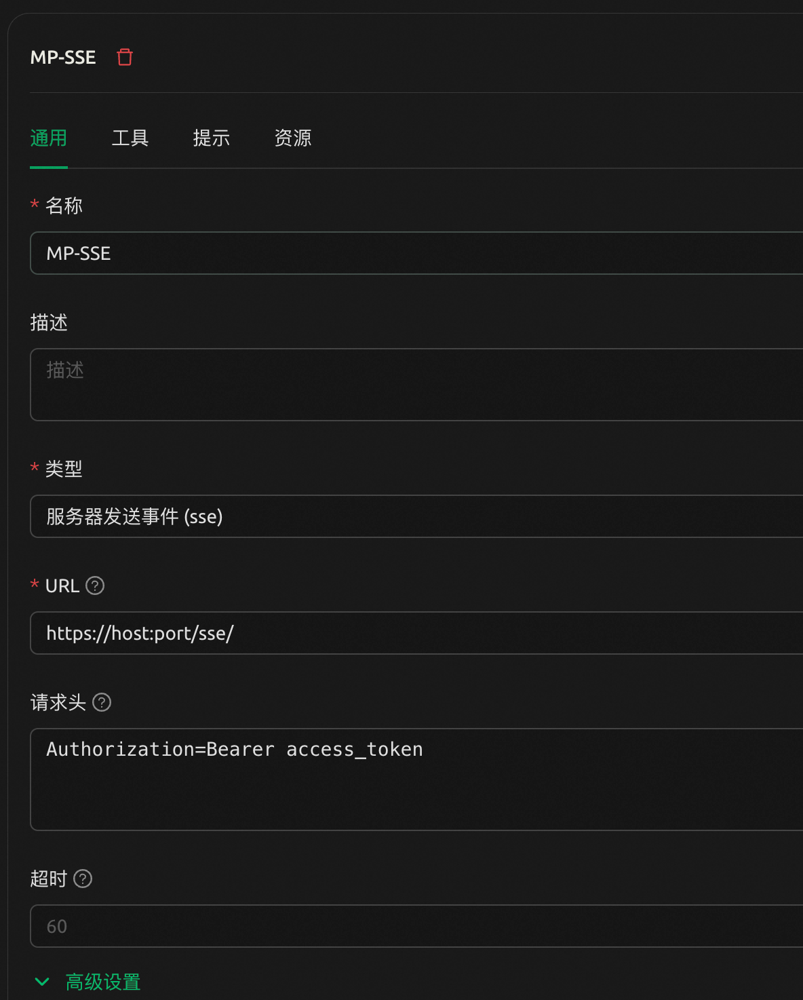

# MCP Server使用手册

## 插件介绍

MCP Server 是一个为 MoviePilot 提供大语言模型服务的插件，它通过启动一个本地服务器，使用户能够通过自然语言与 MoviePilot 进行交互，实现电影资源的搜索、下载、订阅等功能。

## 功能特点

- **自然语言交互**：通过大语言模型理解用户意图，执行相应操作
- **电影资源搜索**：根据电影名称、年份、分辨率等条件搜索资源
- **资源下载**：支持下载找到的电影资源，并在下载前进行确认
- **资源订阅**：支持订阅电影、电视剧资源，自动追踪更新
- **媒体识别**：智能识别用户提供的模糊媒体信息，转换为准确的媒体数据
- **智能建议**：自动检查和纠正电影名称错误
- **人物作品查询**：查询演员、导演等人物的参演作品
- **PT站点统计**：查询PT站点的详细数据统计

## 安装与配置

1. 在 MoviePilot 插件市场中安装 MCP Server 插件
2. 启用插件后，进入插件配置页面
3. 配置以下参数：
   - **用户名/密码**：用于获取 MoviePilot 的访问令牌
   - **API 密钥（自动生成）**：用于与 MCP Server 通信的密钥
   - **服务器类型**：选择 HTTP Streamable 或 Server-Sent Events (SSE)
   - **监听地址和端口**：配置服务器监听的地址和端口

## MCP工具详细文档

### 工具列表

| 工具名称 | 描述 | 必需参数 | 可选参数 | 示例用法 | 返回格式 |
|---------|------|----------|----------|----------|----------|
| **用户信息工具** |
| `user-info` | 获取当前用户信息 | 无 | 无 | `user-info` | 用户详细信息文本 |
| `get-user` | 获取指定用户信息 | `username` (string) | 无 | `get-user username="admin"` | 指定用户详细信息文本 |
| **站点管理工具** |
| `get-sites` | 获取所有站点信息 | 无 | 无 | `get-sites` | 站点列表（ID、名称、优先级） |
| **媒体识别工具** |
| `recognize-media` | 识别媒体信息 | `title` (string) | `year` (string), `type` (enum: 电影/电视剧) | `recognize-media title="星际穿越" year="2014"` | 媒体详细信息（TMDB ID、豆瓣ID等） |
| `search-media` | 搜索媒体或人物信息 | `keyword` (string) | `type` (enum: media/person), `page` (int), `count` (int) | `search-media keyword="克里斯托弗·诺兰" type="person"` | 搜索结果列表 |
| `person-credits` | 查询人物参演作品 | `person_id` (int) | `page` (int), `year` (int) | `person-credits person_id=525 year=2023` | 人物作品列表（电影、电视剧） |
| **资源搜索工具** |
| `search-media-resources` | 搜索媒体资源 | `sites` (string) | `keyword` (string), `mediaid` (string), `year` (string), `resolution` (string), `media_type` (string), `limit` (int) | `search-media-resources mediaid="tmdb:157336" sites="1,2,3"` | 资源列表（包含资源标识符） |
| `fuzzy-search-media-resources` | 模糊搜索媒体资源 | `keyword` (string), `sites` (string) | `page` (int), `detailed` (bool), `limit` (int) | `fuzzy-search-media-resources keyword="星际穿越" sites="1,2"` | 模糊匹配的资源列表 |
| `search-site-resources` | 在指定站点搜索资源 | `site_id` (string), `keyword` (string) | `cat` (string), `limit` (int) | `search-site-resources site_id="1" keyword="星际穿越" cat="501"` | 站点特定资源列表 |
| **下载工具** |
| `get-downloaders` | 获取可用下载器列表 | 无 | 无 | `get-downloaders` | 下载器列表（名称、类型） |
| `download-torrent` | 下载种子资源 | `media_type` (string) | `torrent_url` (string), `resource_id` (string), `downloader` (string), `save_path` (string) | `download-torrent resource_id="abc123" media_type="电影"` | 下载状态信息 |
| **订阅管理工具** |
| `list-subscribes` | 获取所有订阅列表 | 无 | 无 | `list-subscribes` | 订阅列表详情 |
| `get-subscribe-by-media` | 通过媒体ID获取订阅 | `media_id` (string) | 无 | `get-subscribe-by-media media_id="tmdb:157336"` | 特定媒体的订阅信息 |
| `add-subscribe` | 添加新订阅 | `name` (string) | `type` (enum), `year` (string), `season` (int), `tmdbid` (int), `doubanid` (string), `keyword` (string), `sites` (array), `downloader` (string) 等 | `add-subscribe name="星际穿越" type="电影" tmdbid=157336` | 订阅创建结果 |
| `delete-subscribe` | 删除订阅 | `id` (int) | 无 | `delete-subscribe id=123` | 删除操作结果 |
| `get-subscribe-detail` | 获取订阅详情 | `id` (int) | 无 | `get-subscribe-detail id=123` | 订阅详细信息 |
| `update-subscribe` | 更新订阅信息 | `id` (int) | 与add-subscribe相同的可选参数 | `update-subscribe id=123 name="新名称"` | 更新操作结果 |
| **数据统计工具** |
| `query-pt-stats` | 查询PT站点统计数据 | `site_domain` (string) 或 `site_name` (string) | 无 | `query-pt-stats site_name="馒头"` | PT站点详细统计（魔力值、做种数、分享率等） |

### 提示（Prompts）列表

| 提示名称 | 功能/目的 | 输入要求 | 示例用法 | 预期输出 |
|---------|----------|----------|----------|----------|
| `search-movie-strategy` | 指导如何高效地搜索电影资源 | `keyword` (必需), `year` (可选) | `search-movie-strategy keyword="星际穿越" year="2014"` | 详细的电影资源搜索策略指南，包括搜索步骤、评估标准、失败处理等 |
| `person-credits-strategy` | 指导如何搜索和展示演员、导演等人物的参演作品 | `name` (必需), `year` (可选) | `person-credits-strategy name="克里斯托弗·诺兰" year="2023"` | 人物作品搜索和展示策略，包括搜索方法、分页处理、结果展示格式等 |

### 参数说明

#### 资源分类代码（cat参数）
- `501` = 电影
- `502` = 剧集/电视剧
- `503` = 纪录片
- `504` = 动画
- `505` = 综艺

#### 媒体ID格式
- TMDB格式：`tmdb:123456`
- 豆瓣格式：`douban:123456`
- Bangumi格式：`bangumi:123456`

#### 站点ID获取
使用 `get-sites` 工具获取所有可用站点的ID、名称和优先级信息。

### 认证要求

所有MCP工具调用都需要Bearer Token认证：
- **Header方式**：`Authorization: Bearer your_access_token`
- **URL参数方式**：`?token=your_access_token`（需要Nginx配置支持）

访问令牌可在插件配置页面获取或重新生成。

### 使用示例

#### 1. 媒体搜索和资源下载完整流程

```
用户：请帮我搜索并下载电影《星际穿越》，要求4K分辨率

AI执行步骤：
1. search-media keyword="星际穿越" type="media"
2. search-media-resources mediaid="tmdb:157336" sites="1,2,3" resolution="4K"
3. download-torrent resource_id="abc123" media_type="电影"
```

#### 2. 人物作品查询流程

```
用户：查询克里斯托弗·诺兰2023年的作品

AI执行步骤：
1. search-media keyword="克里斯托弗·诺兰" type="person"
2. person-credits person_id=525 year=2023
```

#### 3. 订阅管理流程

```
用户：订阅《权力的游戏》第8季

AI执行步骤：
1. search-media keyword="权力的游戏" type="media"
2. add-subscribe name="权力的游戏" type="电视剧" season=8 tmdbid=1399
```

#### 4. PT站点统计查询

```
用户：查看馒头站点的统计数据

AI执行步骤：
1. query-pt-stats site_name="馒头"
```

### 客户端配置示例

#### Cherry Studio

目前仅在Cherry Studio上测试过：

##### Streamable HTTP

MCP Server插件中选择服务器类型为`HTTP Streamable`，然后在Cherry Studio中配置如下：



JSON格式配置如下：

```json
 "moviepilot": {
      "url": "https://host:port/mcp/",
      "headers": {
          "Authorization": "Bearer access_token",
          "Content-Type": "application/json"
      }
  }
```

##### Server-Sent Events (SSE)

MCP Server插件中选择服务器类型为`Server-Sent Events (SSE)`，然后在Cherry Studio中配置如下：



JSON格式配置如下：

```json
 "moviepilot_sse": {
      "url": "https://host:port/sse/",
      "headers": {
          "Authorization": "Bearer access_token",
      }
  }
```

其中{host}是Movie Pilot的外网访问域名，{port}是监听端口，可在配置也配置。
{access_token}是MCP Server的认证令牌，可在配置页面获取。

## 高级使用技巧

### 搜索策略优化

1. **精确搜索优先**：先使用 `search-media` 获取准确的媒体ID，再用 `search-media-resources` 搜索资源
2. **站点选择**：通过 `get-sites` 获取站点列表，优先选择高优先级站点
3. **模糊搜索备用**：当精确搜索失败时，使用 `fuzzy-search-media-resources` 进行模糊搜索
4. **分批搜索**：避免一次搜索过多站点，建议每次搜索3-5个站点

### 资源筛选技巧

1. **分辨率筛选**：使用 `resolution` 参数指定期望的清晰度（如 "4K", "1080p", "720p"）
2. **资源评估**：关注做种人数、资源大小、字幕信息等指标
3. **免费资源**：优先选择有流量优惠的资源
4. **制作组选择**：根据制作组声誉选择高质量资源

### 批量操作

1. **批量订阅**：可以连续调用 `add-subscribe` 添加多个订阅
2. **订阅管理**：定期使用 `list-subscribes` 查看和管理订阅状态
3. **站点统计**：使用 `query-pt-stats` 监控各站点的数据状况

## 推荐的System Prompt

```text
# MoviePilot MCP Server 操作指南

你是一个专业的影视资源管理助手，通过MoviePilot MCP Server帮助用户搜索、下载和管理影视资源。

## 核心操作策略

### 电影资源搜索策略
1. **媒体识别**：先用search-media工具获取媒体信息，确认正确的mediaid
2. **资源搜索**：使用search-media-resources工具搜索资源，优先使用mediaid参数
3. **站点选择**：通过get-sites获取站点列表，依次从优先级高到低选择3-5个站点
4. **搜索优化**：找到合适资源后停止搜索，避免浪费token
5. **备用方案**：搜索失败时尝试模糊搜索、不同名称变体、原语言名称
6. **指定站点**：若用户指定站点则使用search-site-resources工具

### 人物作品搜索策略
1. **人物确认**：先用search-media工具（type="person"）确认person_id
2. **作品获取**：使用person-credits工具获取作品列表，从第一页开始
3. **分页处理**：
   - 有年份限制：自动获取所有页面
   - 无年份限制：分页展示，询问用户是否继续
4. **信息展示**：按年份排序、分类展示、包含海报和详情链接
5. **后续操作**：如用户对某作品感兴趣，使用返回的media_id搜索资源

### 资源下载策略
1. **下载器选择**：使用get-downloaders获取可用下载器
2. **路径处理**：如未指定保存路径则留空，使用默认路径
3. **资源验证**：下载前确认资源信息和用户意图

### 订阅管理策略
1. **订阅创建**：使用准确的媒体信息创建订阅
2. **参数优化**：根据用户需求设置合适的搜索参数
3. **订阅维护**：定期检查和更新订阅状态

## 展示格式要求

1. **图片展示**：使用markdown格式展示海报图片：

2. **链接格式**：将详情链接格式化为可点击链接：[详情](详情链接)

3. **信息整理**：按类型分类展示，突出重要信息

## 注意事项

1. **隐私保护**：不要暴露包含passkey的下载链接
2. **Token优化**：避免不必要的重复调用，优先从历史消息获取信息
3. **错误处理**：遇到错误时提供清晰的解决建议
4. **用户体验**：提供友好的交互体验，及时反馈操作结果
```

## 怎么玩

### 直连

通过支持自定义Header的客户端,如[Cherry Studio](https://github.com/CherryHQ/cherry-studio)，按照上文配置即可连接。
astrbot最新版也已支持自定义header，可以直连。

### 关闭API Key认证后直连

某些客户端如lobe-chat不支持自定义header，也就无法填写认证的key，导致无法直连。如果mcp server不暴露在公网上，在保证安全性的情况下可以选择关闭API key认证，这样直接填写服务器地址即可直连。

### MCPHub中转

可惜的是目前大部分客户端还不支持自定义Header，所以无法直连到MCP Server。这时我们可以用上一个开源项目[mcphub](https://github.com/samanhappy/mcphub)。它可以聚合多个MCP服务器，提供一个统一的调用接口。

但mcphub仍然不支持自定义Header，所以无法传递认证信息。我们可以通过Nginx来做一层解析，通过在url中传递auth token，在Nginx中提取出来，设置到Header中。配置如下:

```json
server {
    listen 0.0.0.0:3112;  # 端口号与mcp server监听的端口号区别开
    server_name _;        # 通配任意域名访问

    location / {
        access_by_lua_block {
            local token = ngx.var.arg_token
            if token and token ~= "" then
                ngx.req.set_header("Authorization", "Bearer " .. token)
            end
        }

        proxy_pass http://127.0.0.1:3111;  # 后端 MCP Server 地址
        proxy_set_header Host $host;
        proxy_set_header X-Real-IP $remote_addr;
        proxy_set_header X-Forwarded-For $proxy_add_x_forwarded_for;
        proxy_set_header X-Forwarded-Proto $scheme;

        # SSE支持（如果后端有SSE需求）
        proxy_buffering off;
        proxy_cache off;
        proxy_http_version 1.1;
        proxy_set_header Connection "";
        proxy_set_header Accept-Encoding "";
        proxy_read_timeout 3600s;
    }
}
```
将上述内容添加到一个.conf文件放到Nginx的配置目录下，重启Nginx即可。这个配置是将url中的?token=xxx中的xxx解析出来放入到Header中，作为Authorization的参数，这样就不需要在客户端自定义Header了。

接下来安装mcphub，下面是一个compose配置，供参考:
```yml
services:
  mcphub:
    image: samanhappy/mcphub:latest
    container_name: mcphub
    restart: always
    networks:
      - bridge
    ports:
      - "3007:3000"
    volumes:
      - ./mcp_settings.json:/app/mcp_settings.json
    environment:
      - PUID=0
      - PGID=0
networks:
  bridge:
    driver: bridge
```
启动后进入webui添加服务器，服务器类型选择Streamable HTTP（要求MCP Server设置到Streamable HTTP模式，服务器URL填`http://172.17.0.1:3112/mcp/?token=xxxxx`，其中`172.17.0.1`访问到host，根据你自己的情况调整，`3112`是Nginx监听的端口，`xxxxx`是MCP Server的认证令牌，可在配置页面获取。然后点击添加就可以看到刚添加的服务器状态为在线。

服务器添加完成后就可以通过mcphub来调用MCP Server了。比如这里mcphub暴露出来的端口是3007，那么在客户端中配置mcp服务器地址，如果想要Streamable HTTP就填`http://172.17.0.1:3007/mcp`，如果想要SSE就填`http://172.17.0.1:3007/sse`。不建议将mcphub暴露到公网，因为别人只要知道你的域名和端口号就可以直接操作MoviePilot了。可以在局域网部署一些项目用来访问MCP Server，比如我就尝试了下面两种玩法。

#### [lobechat](https://github.com/lobehub/lobe-chat)

安装部署这里就不再赘述了，lobe的MCP入口比较难找，在 助手 -> 插件设置 -> 自定义插件里，选择 Streamable HTTP模式，Streamable HTTP Endpoint URL直接填`http://172.17.0.1:3007/mcp`，然后保存即可。


其它的玩法大家自行摸索哈。有同学可能要问了，为什么不直接在lobe或者astrbot中使用`http://172.17.0.1:3112/mcp/?token=xxxxx`的方式，而非要用mcphub中转一下呢？好问题，我也觉得中间转一次很傻，但是lobe和astrbot直接使用上述链接就是走不通，具体原理我也不太懂了，有同学试出来可以和大家分享一下。

当前的方案只是由于市面上客户端支持度不够的权宜之计，相信很快就会有更多的客户端支持自定义Header，届时就可以直接连到MCP Server了。

## 扩展MCP功能插件开发指引

### 概述

MCP Server 插件支持其他插件向其注册自定义的工具（tools）和提示（prompts），让开发者能够轻松扩展 MCP 功能。通过使用装饰器系统，插件开发者可以大幅减少样板代码，专注于业务逻辑的实现。

### 核心特性

- **极简开发**：使用 `@mcp_tool` 和 `@mcp_prompt` 装饰器自动处理注册
- **自动发现**：自动扫描并注册标记的方法
- **统一错误处理**：内置错误处理和标准化响应格式
- **自动参数验证**：根据 schema 自动验证输入参数
- **零配置**：无需手动编写工具配置和执行方法
- **事件驱动**：自动监听 MCP Server 就绪事件并注册工具
- **故障恢复**：MCP Server 重启后自动重新注册

### 快速开始

#### 1. 基本插件结构

```python
from app.plugins import _PluginBase

# 导入MCP插件助手
try:
    from app.plugins.mcpserver.dev.mcp_dev import (
        mcp_tool,
        mcp_prompt,
        MCPDecoratorMixin
    )
    MCP_DEV_AVAILABLE = True
except ImportError as e:
    # MCP Server 插件不可用时的降级处理
    MCP_DEV_AVAILABLE = False

    def mcp_tool(*args, **kwargs):
        def decorator(func):
            return func
        return decorator

    def mcp_prompt(*args, **kwargs):
        def decorator(func):
            return func
        return decorator

    class MCPDecoratorMixin:
        pass

class MyPlugin(_PluginBase, MCPDecoratorMixin):
    plugin_name = "我的MCP插件"
    plugin_desc = "演示MCP功能扩展"

    def init_plugin(self, config: dict = None):
        # 初始化MCP装饰器支持
        if MCP_DEV_AVAILABLE:
            self.init_mcp_decorators()

    def stop_service(self):
        # 停止MCP装饰器支持
        if MCP_DEV_AVAILABLE and hasattr(self, 'stop_mcp_decorators'):
            self.stop_mcp_decorators()

    def get_api(self) -> list:
        """获取插件API端点（如果需要API功能）"""
        api_endpoints = []

        # 添加MCP相关的API端点
        if hasattr(self, 'get_mcp_api_endpoints'):
            api_endpoints.extend(self.get_mcp_api_endpoints())

        return api_endpoints
```

#### 2. 添加MCP工具

```python
@mcp_tool(
    name="my-greeting",
    description="个性化问候工具",
    parameters=[
        {
            "name": "name",
            "description": "要问候的人的姓名",
            "required": True,
            "type": "string"
        },
        {
            "name": "language",
            "description": "问候语言",
            "required": False,
            "type": "string",
            "enum": ["zh", "en"]
        }
    ]
)
def greeting_tool(self, name: str, language: str = "zh") -> str:
    """问候工具实现"""
    if language == "en":
        return f"Hello, {name}! Welcome to MoviePilot!"
    else:
        return f"你好，{name}！欢迎使用 MoviePilot！"
```

#### 3. 添加MCP提示

```python
@mcp_prompt(
    name="movie-review-prompt",
    description="电影评论生成提示",
    parameters=[
        {
            "name": "movie_title",
            "description": "电影标题",
            "required": True
        },
        {
            "name": "style",
            "description": "评论风格",
            "required": False
        }
    ]
)
def movie_review_prompt(self, movie_title: str, style: str = "专业") -> dict:
    """电影评论提示实现"""
    return {
        "messages": [
            {
                "role": "user",
                "content": {
                    "type": "text",
                    "text": f"请为电影《{movie_title}》写一篇{style}风格的评论"
                }
            }
        ]
    }
```

### 参数格式说明


```python
parameters=[
    {
        "name": "参数名",
        "description": "参数描述",
        "required": True,  # 是否必需
        "type": "string",  # 参数类型：string, integer, number, boolean, array, object
        "enum": ["选项1", "选项2"]  # 可选：枚举值
    }
]
```

### 功能控制

可以通过设置类属性来控制MCP功能的启用：

```python
class MyPlugin(_PluginBase, MCPDecoratorMixin):
    # 控制功能开关
    _enable_tools = True      # 启用工具注册
    _enable_prompts = True    # 启用提示注册

    def init_plugin(self, config: dict = None):
        # 根据配置动态调整
        if config:
            self._enable_tools = config.get("enable_tools", True)
            self._enable_prompts = config.get("enable_prompts", True)

        self.init_mcp_decorators()
```

## 事件机制

MCP插件系统使用事件驱动的注册机制：

1. **插件启动** → 注册事件监听器
2. **MCP Server启动** → 发送 `mcp_server_ready` 事件
3. **插件收到事件** → 异步注册工具和提示
4. **MCP Server重启** → 再次发送事件，插件自动重新注册

### 最佳实践

#### 1. 导入保护

始终使用 try-catch 保护 MCP 导入，确保插件在 MCP Server 不可用时仍能正常工作：

```python
try:
    from app.plugins.mcpserver.dev.mcp_dev import (
        mcp_tool, mcp_prompt, MCPDecoratorMixin
    )
    MCP_DEV_AVAILABLE = True
except ImportError:
    MCP_DEV_AVAILABLE = False
    # 定义空装饰器
```

#### 2. 专注业务逻辑

装饰器系统自动处理注册、验证、错误处理等，让你专注于业务逻辑：

```python
@mcp_tool(name="business-tool", description="业务工具")
def business_tool(self, input_data: str) -> dict:
    # 直接编写业务逻辑，其他都自动处理
    processed = process_business_data(input_data)
    return {"result": processed}
```

### 示例项目

完整示例请参考：[MCPToolExample](../mcptoolexample/__init__.py)

## 技术支持

如有任何问题或建议，请通过以下方式联系：

- GitHub Issues: [MoviePilot-Plugins](https://github.com/DzAvril/MoviePilot-Plugins)